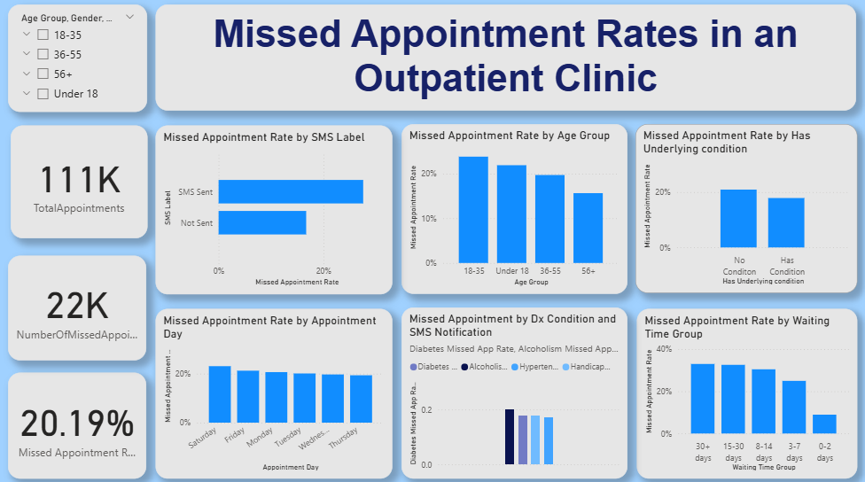
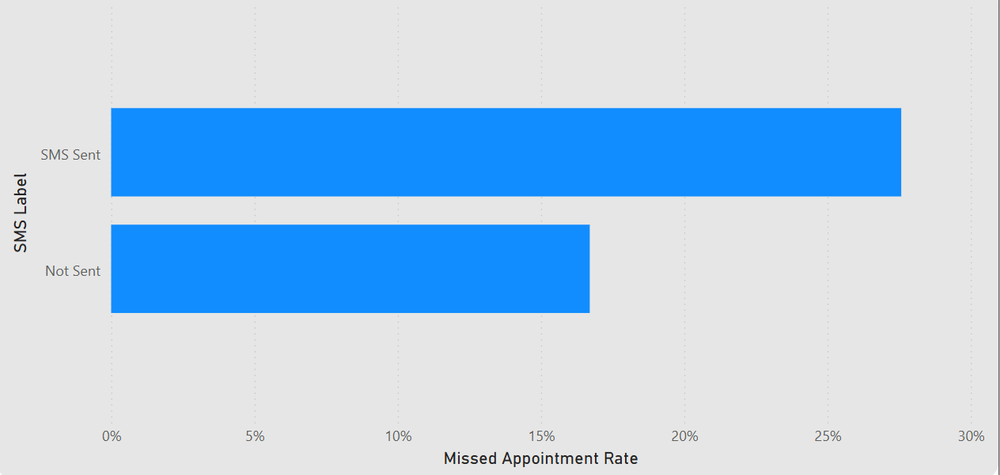

# Reducing Missed Appointments in an Outpatient Clinic  
*A Healthcare Data Analytics Case Study*

---

## Project Overview
Missed outpatient appointments reduce clinic efficiency, disrupt continuity of care, and lead to underutilized clinical capacity. This case study analyzes outpatient appointment data to identify the primary drivers of no show behavior and to surface actionable interventions that clinics can apply to improve appointment adherence.

I analyzed over 110,000 outpatient appointment records to understand which factors most strongly influence attendance and which of those factors can realistically support operational decision making.

---

## Business Context
The outpatient clinic experienced a persistent decline in completed follow up appointments, resulting in unused appointment slots and avoidable strain on clinical operations.

The core business question was straightforward. Given the information available at the time of booking, which signals indicate a higher risk of missed appointments and how can those signals inform scheduling and outreach strategies?

---

## Stakeholders
- Head of Hospital (primary decision maker)  
- Lead Doctor  
- Lead Nurse  
- Outpatient Operations Team  

---

## Dataset
**Source:** Medical Appointment No Shows (Brazil) – Kaggle  
🔗 https://www.kaggle.com/datasets/joniarroba/noshowappointments

**Size:**  
- 110,527 appointment records 
- 14 variables

Key data elements include appointment scheduling details, patient demographics, reminder indicators, attendance outcomes, and selected chronic condition flags.

The dataset is anonymized and publicly available. While the data reflects Brazilian outpatient clinics, the behavioral patterns analyzed are relevant across similar healthcare settings.

---

## Analytical Approach
The analysis prioritizes interpretability and decision relevance over model complexity. The objective was not to predict individual behavior with maximum accuracy, but to identify patterns that can support operational action.

Core performance indicators were defined to quantify missed appointment behavior, and comparative analysis was used to assess how attendance varies across waiting time, reminder usage, age groups, and health status.

--- 

### 1. Waiting Time Impact

Waiting time between scheduling and appointment date is the strongest driver of missed appointments. Appointments scheduled far in advance show significantly higher no show rates, even when reminder messages are sent.

---

### 2. SMS Reminders vs Missed Appointments

SMS reminders alone do not meaningfully reduce missed appointments for long lead time bookings. Their presence often reflects higher risk scheduling rather than serving as a corrective intervention.

---

### 4. Age Group Analysis

Younger patients, particularly those between ages 18 and 35, exhibit higher no show rates compared to older patients.

---

### 5. Underlying Medical Conditions

Patients managing chronic conditions are generally more consistent attendees, while patients without ongoing conditions miss appointments more frequently. Behavioral health indicators show elevated no show risk and may require additional support.

---

## Operational Implications
The findings suggest that no shows are primarily a scheduling risk issue rather than a communication failure.

Reducing appointment lead times where possible, identifying high risk bookings early, and tailoring engagement strategies by patient segment are likely to be more effective than increasing reminder volume alone.

Even modest improvements in attendance rates could significantly improve clinic utilization and patient access.

---

## Recommendations
Prioritize shorter scheduling windows for outpatient appointments where operationally feasible.

Flag long lead time appointments at the point of booking for proactive confirmation or rescheduling.

Apply differentiated engagement strategies for younger patient segments.

Provide targeted scheduling support for patients with behavioral and substance related conditions.

---

## Deliverables
- Interactive Power BI dashboard supporting exploratory and comparative analysis
- Medium article presenting the full decision narrative
- GitHub documentation and project assets  

🔗 **Medium article:** *(https://ibinaboadiela.medium.com/why-patients-miss-appointments-what-110-000-hospital-records-taught-me-about-missed-appointments-931162d24106)*

---
## Tools Used

- Excel for data preparation
- Power BI for modeling, analysis, and visualization

## Closing Note

This case study demonstrates how operational data can be translated into practical scheduling and engagement decisions. By focusing on decision relevant signals rather than surface level assumptions, healthcare organizations can reduce missed appointments and improve clinic efficiency at scale.